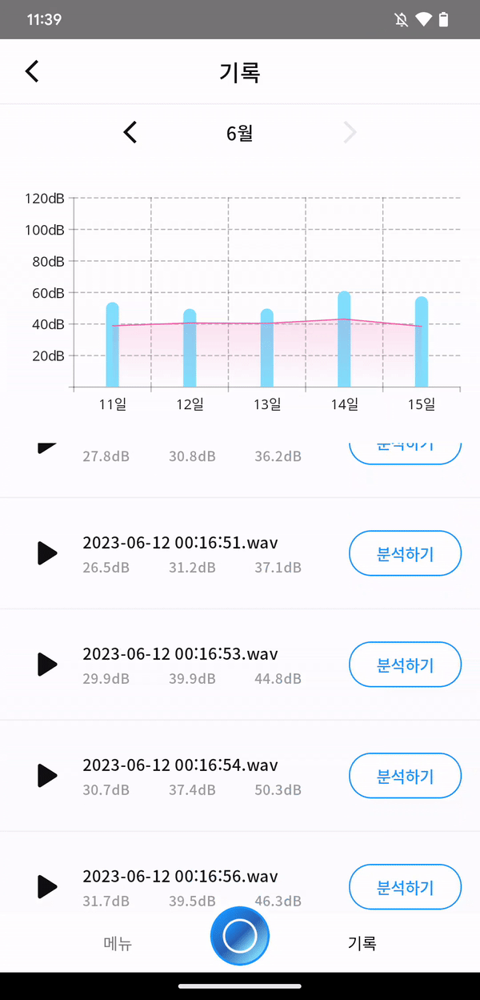

# Greenie Project
## Introduction
'잡았다! 소음'은 새싹톤 '그리니' 팀에서 일상 생활에서의 생활 소음 문제를 해결하기 위해 개발한 소음 분석 및 분쟁 해결 서비스입니다.

## 📱 Feature ##

### 소음원 AI 분석 및 녹음 ###

<br>

### 트래킹 검사 기능 ###

<br>

### 소음 기록 ###

<br>

## ⚡Stack ##
   

## 📕 Used library ##
* Jetpack Compose
  * 명령형 UI 라이브러리입니다.
* Tensorflow lite
  * 모바일 환경에서 AI분석을 진행하기 위한 라이브러리입니다.
* Dagger hilt
  * 의존성 주입 라이브러리로 DI를 통한 모듈 분리를 위해 사용합니다.
* Retrofit2
  * 안드로이드에서 범용적으로 사용하는 API 통신을 위한 네트워크 라이브러리입니다.
* Flow
  * 비동기 데이터 흐름을 관리하기 위한 라이브러리입니다.

## 🐾 Architecture ##
Clean Architecture 및 MVVM 아키텍처를 멀티모듈 구조에 적용하여, 크게 Data -> Domain <- UI 의 구조를 가지며,
Dagger hilt를 통한 DI를 활용하여 UI에서 필요한 비즈니스 로직을 호출할 수 있습니다.

* app: 앱 수준 및 네비게이션 제어 등을 담당하는 앱의 시작점을 가르키는 모듈입니다. Core 및 Feature 등의 모듈을 의존합니다.
* core: 앱 구동간에 필요한 코드 및 특수 목적을 위한 공통 라이브러리 모듈입니다. Core 모듈 내 타 모듈에 대한 종속성을 가지지 않습니다.
* feature: 앱에서 단일 책임을 처리하도록 범위가 정해진 기능 모듈입니다. Core 내의 모듈만 의존합니다.

## 🏗 Module ##

|Name|Responsibilities|
| :- | :- |
|`app`|앱이 동작하는데 필요한 것들을 제공하며 진입점 역할을 합니다. UI 및 탐색 제어를 포함합니다.<br>또한 앱 실행 시 Firebase Token을 생성하여 Firebase Cloud Messaging 수신 및 백엔드 서버와 API 통신 시 유저를 식별할 수 있도록 합니다.|
|`feature:home`<br>`feature:record`<br>`feature:tracking`<br>`feature:history`<br>`feature:result`<br>`feature:web`|특정 기능을 위한 UI 및 ViewModel을 포함합니다.<ul><li>`feature:` .. 기능을 가진 진입점 UI입니다.</li><li>`feature:` 를 표시하는 UI입니다.</li></ul>|
|`core:common`|앱에서 자주 사용하는 기능 클래스를 포함합니다.| 
|`core:data`|Database 및 local datasource로 부터 앱 데이터를 가져옵니다.|
|`core:designsystem`|UI 관련 Theme, Color, TextStyle, Shape 등을 포함하는 모듈입니다.|
|`core:domain`|Clean architecture의 Domain layer에 해당하는 영역으로 종속성 주입(DI)를 위한 인터페이스와 비즈니스 로직을 포함한 UseCase를 포함합니다.|
|`core:model`|앱 전체에서 공통으로 사용되는 모델 클래스입니다.|
|`core:service`|소음 분석 및 트래킹 기능을 위한 Foreground service를 포함합니다. |
|`core:ui`|앱에서 공통적으로 사용되는 UI 구성요소 및 리소스 모음입니다.|


## License
```
MIT License

Copyright (c) 2023 daryeou

Permission is hereby granted, free of charge, to any person obtaining a copy
of this software and associated documentation files (the "Software"), to deal
in the Software without restriction, including without limitation the rights
to use, copy, modify, merge, publish, distribute, sublicense, and/or sell
copies of the Software, and to permit persons to whom the Software is
furnished to do so, subject to the following conditions:

The above copyright notice and this permission notice shall be included in all
copies or substantial portions of the Software.

THE SOFTWARE IS PROVIDED "AS IS", WITHOUT WARRANTY OF ANY KIND, EXPRESS OR
IMPLIED, INCLUDING BUT NOT LIMITED TO THE WARRANTIES OF MERCHANTABILITY,
FITNESS FOR A PARTICULAR PURPOSE AND NONINFRINGEMENT. IN NO EVENT SHALL THE
AUTHORS OR COPYRIGHT HOLDERS BE LIABLE FOR ANY CLAIM, DAMAGES OR OTHER
LIABILITY, WHETHER IN AN ACTION OF CONTRACT, TORT OR OTHERWISE, ARISING FROM,
OUT OF OR IN CONNECTION WITH THE SOFTWARE OR THE USE OR OTHER DEALINGS IN THE
SOFTWARE.
```
