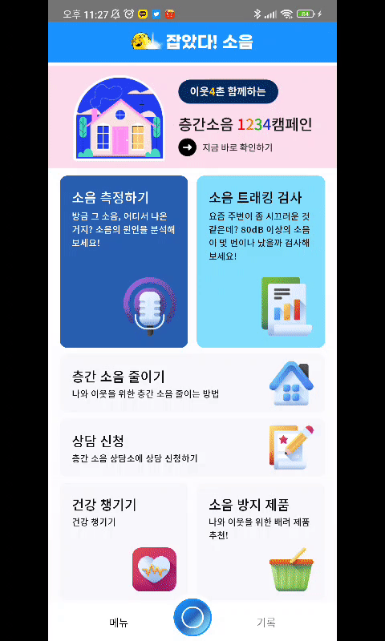
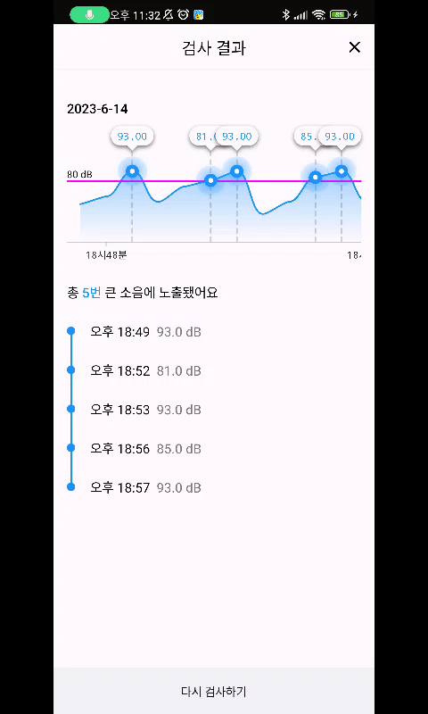

# Greenie Project
## Introduction
'잡았다! 소음'은 새싹톤 '그리니' 팀에서 일상 생활에서의 생활 소음 문제를 해결하기 위해 개발한 소음 분석 및 분쟁 해결 서비스입니다.

## 📱 Feature ##

### 소음원 AI 분석 및 녹음 ###

<br>

### 트래킹 검사 기능 ###

<br>

<br>

## ⚡Stack ##
   

## 📕 Used library ##
* Jetpack Compose
  * 명령형 UI 라이브러리입니다.
* Tensorflow lite
  * 모바일 환경에서 AI분석을 진행하기 위한 라이브러리입니다.
* Dagger hilt
  * 의존성 주입 라이브러리로 DI를 통한 모듈 분리를 위해 사용합니다.
* Retrofit2
  * 안드로이드에서 범용적으로 사용하는 API 통신을 위한 네트워크 라이브러리입니다.
* Flow
  * 비동기 데이터 흐름을 관리하기 위한 라이브러리입니다.

## 🐾 Architecture ##
Clean Architecture 및 MVVM 아키텍처를 멀티모듈 구조에 적용하여, 크게 Data -> Domain <- UI 의 구조를 가지며,
Dagger hilt를 통한 DI를 활용하여 UI에서 필요한 비즈니스 로직을 호출할 수 있습니다.

* app: 앱 수준 및 네비게이션 제어 등을 담당하는 앱의 시작점을 가르키는 모듈입니다. Core 및 Feature 등의 모듈을 의존합니다.
* core: 앱 구동간에 필요한 코드 및 특수 목적을 위한 공통 라이브러리 모듈입니다. Core 모듈 내 타 모듈에 대한 종속성을 가지지 않습니다.
* feature: 앱에서 단일 책임을 처리하도록 범위가 정해진 기능 모듈입니다. Core 내의 모듈만 의존합니다.

## 🏗 Module ##

|Name|Responsibilities|
| :- | :- |
|`app`|앱이 동작하는데 필요한 것들을 제공하며 진입점 역할을 합니다. UI 및 탐색 제어를 포함합니다.<br>또한 앱 실행 시 Firebase Token을 생성하여 Firebase Cloud Messaging 수신 및 백엔드 서버와 API 통신 시 유저를 식별할 수 있도록 합니다.|
|`feature:home`<br>`feature:record`<br>`feature:tracking`<br>`feature:history`<br>`feature:result`<br>`feature:web`|특정 기능을 위한 UI 및 ViewModel을 포함합니다.<ul><li>`feature:home` 앱의 기능들을 실행할 수 있는 진입점 UI입니다.</li><li>`feature:record` 녹음 서비스 실행 및 현재 데시벨을 확인하고 분석/저장하는 기능을 제공하는 UI입니다.</li><li>`feature:tracking` 장시간 녹음을 통해 큰소리가 발생한 시간을 기록하고 결과를 제공하는 UI입니다.</li><li>`feature:history` 소음 분석 기록을 제공하는 UI입니다.</li><li>`feature:result` AI를 통한 소음원 분석 결과를 가져오는 동안 표시하는 UI입니다.</li><li>`feature:web` 앱에서 접근하는 웹에 동일한 인터페이스와 기능을 제공하는 UI입니다.</li></ul>|
|`core:common`|앱에서 자주 사용하는 기능 클래스를 포함합니다.| 
|`core:data`|Database 및 Sharedpreference로 부터 앱 데이터를 가져오거나 저장합니다.|
|`core:designsystem`|UI 관련 Theme, Color, TextStyle, Shape 등을 포함하는 모듈입니다.|
|`core:domain`|Clean architecture의 Domain layer에 해당하는 영역으로 종속성 주입(DI)를 위한 인터페이스와 비즈니스 로직을 포함한 UseCase를 포함합니다.|
|`core:model`|앱 전체에서 공통으로 사용되는 모델 클래스입니다.|
|`core:service`|소음 분석 및 트래킹 기능을 위한 Foreground service를 포함합니다. |
|`core:ui`|앱에서 공통적으로 사용되는 UI 구성요소 및 리소스 모음입니다.|

## ❗Troubleshooting ##

- 오디오 관련 라이브러리 MediaRecorder VS AudioRecord ?
    - MediaRecorder는 음성 및 영상을 손쉽게 녹음, 녹화 할 수 있는 인터페이스를 제공하지만, 인코딩 된 파일을 제공하는 이유로 녹음된 파형을 실시간으로 분석할 수 없다는 문제가 있습니다.
    - 따라서 PCM Data를 받을 수 AudioRecord 라이브러리를 사용하여, Tensorflow 모델을 활용하여 실시간으로 소음의 제공원을 분석하고, 시스템에서 할당한 최소 버퍼크기를 가져와 Amplitude의 최대값을 바탕으로 decibel을 연산하여 표시합니다.
    - 사용한 공식은 다음과 같습니다.
    p = getMaxAmplitude()/51805.5336
    X = 20 log_10 (p/p0)
- 소음원 분석 서비스 관련하여, AI연산 간에 처리시간이 오래걸리는데 어떻게 처리를 하나요?
    - 녹음 종료 시, Android/data/com.greenie.app/files/media 내에 Wav 파일 형식으로 저장 후, 저장한 음원 파일을 1초 간격으로 나누어 0.1초 간 45db이상 측정 시, 소음원 추정 결과를 데이터 통계에 결과값을 추가합니다.
- 백그라운드에서 계속 돌리는 것에 배터리 소모가 크지는 않나요?
    - 녹음 중에는 오직 음원 저장만을 목표로 동작하며, 국내 제조사 휴대폰 기준 시간 당 2% 정도 소비하는 것을 확인하였습니다.
- 백그라운드 상태에서도 녹음 기능 사용이 가능한가요?
    - 녹음 및 트래킹을 위한 Foreground Service를 사용하여, 앱이 백그라운드 상태에 있을때도 정상적으로 동작합니다.
- 녹음 버튼을 클릭 후, 1초 내외로 짧게 Delay가 발생합니다.
    - 이는 정상적인 경우로, 마이크의 활성화 후 앱에서 데이터를 전달 받기까지 일정시간 빈 ByteArray가 전달되는 것을 확인하였고, 유의미한 값이 전달될 때 까지 대기시키도록 구현하였습니다.
    - 초기 이러한 동작의 사이드 이팩트로 서비스를 반복적으로 실행/중지 했을 경우 오류가 발생하였으나 CoroutineScope를 활용하여 같은 스레드 위에서 구동하게 함으로써 해결하였습니다.
- 장시간 녹음 시, java.lang.OutOfMemoryError 가 발생할수도 있나요?
    - 초기에는 ByteArray를 지역변수를 할당하여 Stack 메모리 위에 적재되도록 구현하였으나, 장시간 녹음 시 OutOfMemoryError가 발생하였습니다. 따라서 현재는 App의 Data 영역에 파일을 생성하여 InputStream/OutputStream을 통해 wav로 Export/Import 하도록 수정하였습니다.

## ✏️ Release Note ##

2023.06.04 (일)

- 소음 측정(실시간, 최소, 평균, 최대)
- PCM 형태로 Android/data/com.greenie.app/files/media 폴더에 pcm 형태로 임시 저장 후, 저장 또는 분석 버튼 클릭 시 wav 파일로 변환
- 서비스를 반복적으로 실행/중지 했을 경우 오류가 발생하는 현상 수정
    - CoroutineScope를 통해 작업이 진행 중인지 판단 후, 안정적으로 작업이 종료되어야 다음 작업이 실행되도록 변경

2023.06.09 (금)

- 안정성 개선
    - 파일 호출이 비정상적일 경우, 
    DB에서 데이터 제거 및 에러 메시지(”녹음 파일이 제거되었거나, 오류가 있습니다.”) 표시
- 서비스 안정화
    - 장시간 녹음 시, 버퍼를 사용하여 주기적으로 저장소에 PCM 형식으로 저장 후 Wav 형식으로 변환합니다.
- Tensorflow Analyze 알고리즘 개선
    - 여러 테스트를 통해 세부 분석 방법을 구체화하였습니다.

        *SAMPLE_RATE = 시스템에 의한 결정(44100, 22050, 16000, 11025, 8000)*
        
        CHANNEL_CONFIG = AudioFormat.*CHANNEL_IN_MONO*
        
        AUDIO_FORMAT = AudioFormat.*ENCODING_PCM_16BIT*
        
        *SPLIT_SIZE* = *SAMPLE_RATE* * 0.1f // 0.1초 간격
        
        *SKIP_SIZE* = *SAMPLE_RATE* * 0.9f // 0.9초 만큼 건너뜀
        
        *DECIBEL_CUT_LINE* = 45.0f // 45db 이상일 경우
        
        *CALCULATE_THRESHOLD* = 0.66f // accracy 66% 이상
        
        *DEFAULT_NUM_OF_RESULTS* = 4
        
        - 녹음 음원을 *SPLIT_SIZE구간으로 나누어 소리의 크기가 DECIBEL_CUT_LINE 이상일 때, accuracy가 CALCULATE_THRESHOLD보다 큰 값이 나오면 해당 카테고리의 점수를 1점씩 부여.*

- 소음 측정
    - 결과 표시를 위한 WebView 추가(Bridge Interface 등 추가기능 구현)
        - 브릿지명(객체명): "Android"
        메시지 띄우기: showToast({텍스트})
        뒤로가기: onBackPress()
        다시녹음하기: onNavigateToRecord()
        e.g.) Android.onBackPress()
                 Android.showToast("테스트 문구입니다")
- 기록
    - 날짜별 녹음 기록
    - 날짜별 평균, 최대 dB을 그래프로 표시
    - 재생 기능 추가
    - 재생 시 파일을 불러올 수 없는 경우, 메시지(“파일을 불러올 수 없습니다.” ) 표시
    - ‘분석하기’, ‘분석결과’ 버튼 추가
- 분석 결과
    - WebView Settings에 *MIXED_CONTENT_ALWAYS_ALLOW* 정책 추가
    

2023.06.10 (토)

- 안정성 개선
    - 화면 이동 Navigation route 개선
- 홈
    - UI 및 Function 추가
- 녹음
    - 재생/일시정지 시 최소값/평균값/최대값이 사라지는 현상 수정
- 소음원 연산 오류 수정
- 텐서플로우 처리 속도 개선
    - 녹음 형식을 44.1KHz에서 16KHz으로 음성원을 분석할 수 있는 최소 요건으로 조정
    - 음원의 모든 부분이 아닌 1초에 0.1초만 추출하여 일부분만 검사하도록 재설계

2023.06.11 (일)

- 웹뷰 인터페이스 및 클라이언트 추가
    - Android.copyToClipboard({텍스트}) 로 클립보드에 삽입 가능합니다.
    - AccompanistWebViewClient를 오버라이딩하여 "intent" 스키마를 처리할 수 있습니다.
        - http://kakao-share.s3-website.ap-northeast-2.amazonaws.com/ 를 통해 공유 기능 확인하였습니다.
- 홈
    - 서비스 상태에 따른 UI 변화(검사중 및 휴식중 표시)
- 분석 결과
    - uid 및 filename 파라미터 추가
- 트래킹 기능
    - 서비스 및 트래킹 기능 추가 (결과 페이지 제외)

2023.06.12 (월)

- 기록
    - 그래프 Axis 값이 동일할 경우 생략
    - 스크롤 위치에 따른 그래프 위치 변화
- 트래킹 검사
    - 시간이 초기화 되는 현상 수정
    - 트래킹 결과 페이지

2023.06.15 (목)

- 그래프 개선
- Firebase 연동

## License
```
MIT License

Copyright (c) 2023 daryeou

Permission is hereby granted, free of charge, to any person obtaining a copy
of this software and associated documentation files (the "Software"), to deal
in the Software without restriction, including without limitation the rights
to use, copy, modify, merge, publish, distribute, sublicense, and/or sell
copies of the Software, and to permit persons to whom the Software is
furnished to do so, subject to the following conditions:

The above copyright notice and this permission notice shall be included in all
copies or substantial portions of the Software.

THE SOFTWARE IS PROVIDED "AS IS", WITHOUT WARRANTY OF ANY KIND, EXPRESS OR
IMPLIED, INCLUDING BUT NOT LIMITED TO THE WARRANTIES OF MERCHANTABILITY,
FITNESS FOR A PARTICULAR PURPOSE AND NONINFRINGEMENT. IN NO EVENT SHALL THE
AUTHORS OR COPYRIGHT HOLDERS BE LIABLE FOR ANY CLAIM, DAMAGES OR OTHER
LIABILITY, WHETHER IN AN ACTION OF CONTRACT, TORT OR OTHERWISE, ARISING FROM,
OUT OF OR IN CONNECTION WITH THE SOFTWARE OR THE USE OR OTHER DEALINGS IN THE
SOFTWARE.
```
